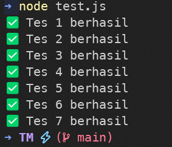

# Tugas Pendahuluan 02: Pemrograman JavaScript

**Nama:** Surya Pradipta  
**NIM:** 103122400061  
**Kelas:** SE-08-02

## Tugas

Buatlah sebuah fungsi bernama `fizzBuzz` yang menerima input larik (array) dan mengembalikan deretan bilangan dan "Fizz" untuk kelipatan 2, "Buzz" untuk kelipatan 7, dan "FizzBuzz" untuk kelipatan 14. Beri nama berkas program sebagai `tm.js` dan taruh di direktori `TM`.

Contoh:

```js
Input:
[8, 9, 32, 75, 84]

Output:
Fizz 9 Fizz 75 FizzBuzz
```

## Program/Kode

Tersedia di [tm.js](./tm.js)

## Output



## Deskripsi

Program ini membuat fungsi `fizzBuzz` yang menerima input array lalu memeriksa setiap angka menggunakan `for` dan  `%`. Jika angka merupakan kelipatan 14 maka diganti `"FizzBuzz"`, kelipatan 2 menjadi `"Fizz"`, dan kelipatan 7 menjadi `"Buzz"`. Fungsi juga mengecek apakah input benar-benar array dengan `Array.isArray()`.
