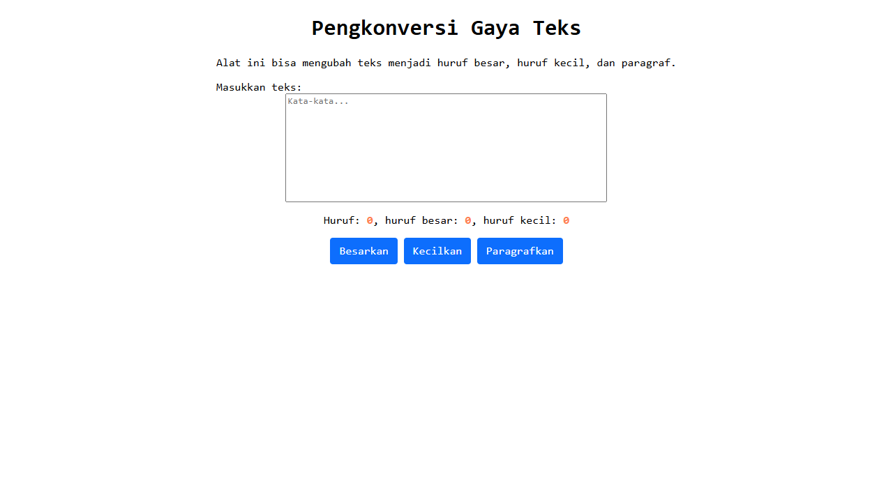

# Tugas Pendahuluan 03: GUI dengan HTML dan CSS

**Nama:** Surya Pradipta  
**NIM:** 103122400061  
**Kelas:** SE-08-02

## Tugas

Buatlah tata letak laman yang kamu buat berada di tengah seperti di bawah ini, dan juga ubah font-nya dengan Inconsolata dari [Google Fonts](https://fonts.google.com/).


## Program/Kode

Tersedia di [index.html](./index.html), [index.js](./index.js) dan [index.css](./index.css)

## Output



## Deskripsi

Tata letak dibuat berada di tengah dengan menggunakan margin auto di css serta menggunakan Font Inconsolata dari Google Fonts.

```css
* {
  font-family: "Inconsolata", monospace;
  max-width: fit-content;
  margin-left: auto;
  margin-right: auto;
}
```