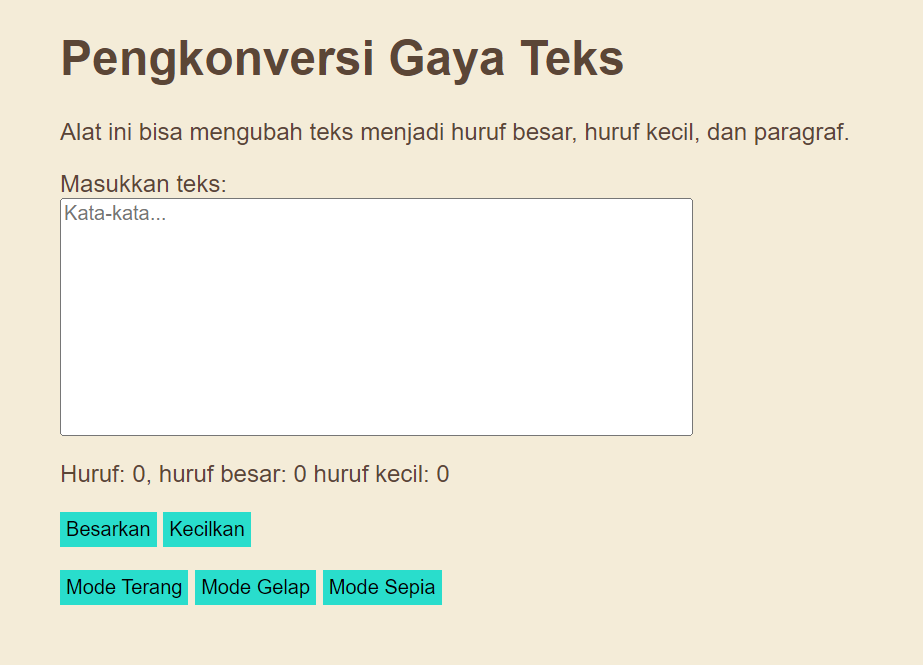

# Tugas Pendahuluan 04: Automata dan Table-Driven Construction

**Nama:** Surya Pradipta  
**NIM:** 103122400061  
**Kelas:** SE-08-02

## Tugas

Tambahkan mode sepia dengan ketentuan:

| Elemen         	| Warna   	|
|----------------	|---------	|
| Latar belakang 	| #F4ECD8 	|
| Warna teks     	| #5B4636 	|

Biarkan form tetap warna putih.

Ketentuan lainnya:

1. Bagian mode-div harus menaungi tiga button: light, dark, dan sepia
2. Bisa berpindah state secara mulus: sepia menghasilkan sepia-mode, dark menghasilkan dark-mode, dan light menghasilkan light-mode

## Program/Kode

Tersedia di [index.html](./index.html), [index.js](./index.js) dan [index.css](./index.css)

## Output

## Deskripsi

Kode ini menambahkan fitur mode sepia di CSS. Saat kelas mode-sepia ditambahkan ke elemen, latar belakang berubah menjadi `#F4ECD8` dan warna teks berubah menjadi `#5B4636`.