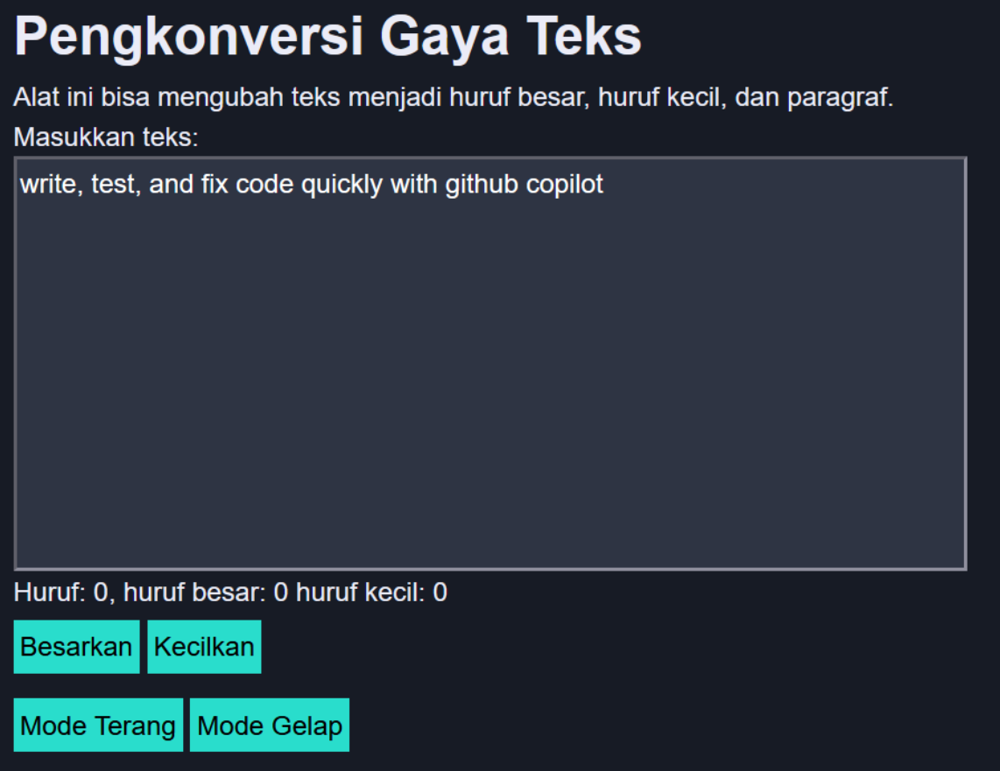

# Tugas Pendahuluan 04: Automata dan Table-Driven Construction

**Nama:** Surya Pradipta  
**NIM:** 103122400061  
**Kelas:** SE-08-02

## Tugas

Tambahkan mode gelap sekaligus untuk editor-kecil dan tombol-tombolnya. Ketentuan warna untuk latar belakang editor-kecil adalah `#2e3443`, sementara untuk tombol adalah `#29ddcc`. Teks untuk tombol tetap mengikuti warna teks sebelumnya.

Untuk menghapus pinggiran tombol, nyatakan properti border untuk tidak ditunjukkan.

## Program/Kode

Tersedia di [index.html](./index.html), [index.js](./index.js) dan [index.css](./index.css)

## Output

## Deskripsi

Kode ini menambahkan fitur mode gelap di CSS. Saat kelas mode-gelap ditambahkan ke elemen, latar belakang editor teks berubah menjadi `#2e3443`, tombol-tombol berubah menjadi warna `#29ddcc` dengan teks gelap, dan semua border dihilangkan.