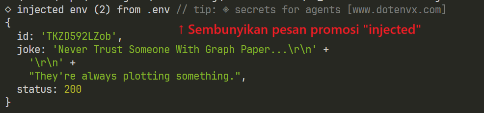
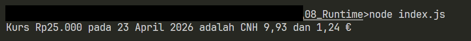

# Tugas Mandiri 08: Runtime Configuration dan Internationalization

**Nama:** Surya Pradipta  
**NIM:** 103122400061  
**Kelas:** SE-08-02

## Tugas

Waktunya menukar uang!

Pada tugas ini kamu akan membuat program yang menampilkan kurs rupiah (IDR) terhadap renminbi luar Tiongkok (CNH) dan euro (EUR). Gunakan link API ini untuk mengambil data.

Tantangan

1. Simpanlah URL API ke dalam .env sebagai BASE_API

2. Gunakan Intl untuk memformat nilai mata uang dan waktu kamu mengambil data kurs.

3. Hapus pesan promosi dotenv

Lalu pastikan outputnya tampak seperti di bawah ini.

## Program/Kode

Tersedia di [index.js](./index.js)

## Output

## Deskripsi

Kode tersebut mengambil data kurs terbaru dari API yang URL-nya disimpan di .env, lalu menghitung konversi beberapa nominal Rupiah (Rp25.000, Rp50.000, dan Rp100.000) ke mata uang CNH dan EUR menggunakan nilai tukar yang diperoleh, kemudian menampilkan hasilnya ke console dengan format mata uang dan tanggal yang rapi menggunakan Intl.