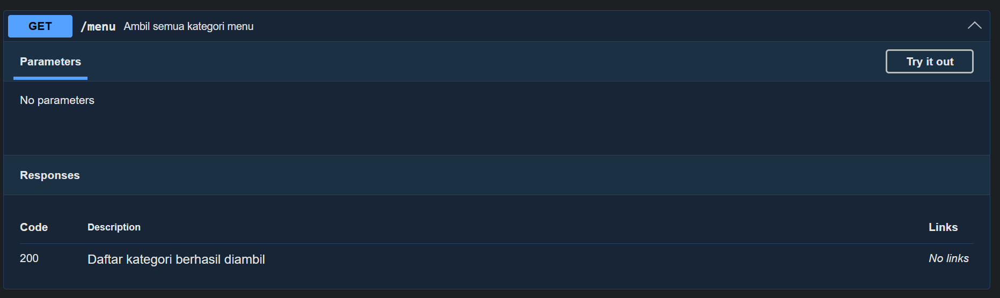
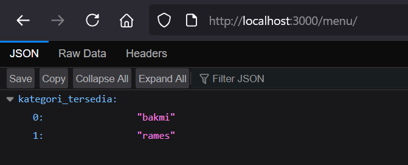

# Tugas Pendahuluan 09: API Design dan Construction Using Swagger

**Nama:** Surya Pradipta  
**NIM:** 103122400061  
**Kelas:** SE-08-02

## Tugas

Buatlah satu endpoint lagi beserta dokumentasi OpenAPI-nya, yaitu GET /menu yang menampilkan daftar semua nama kategori menu yang ada.

Dokumentasi:

Hasil GET:

## Program/Kode

Tersedia di [index.js](./index.js)

## Output

## Deskripsi

Endpoint GET /menu digunakan untuk mengambil daftar seluruh kategori menu yang tersedia dalam sistem, seperti bakmi dan rames, dengan cara membaca kunci (key) dari data menu yang ada, lalu mengembalikannya dalam bentuk array JSON sehingga client dapat mengetahui kategori apa saja yang bisa diakses tanpa perlu memasukkan parameter tambahan.